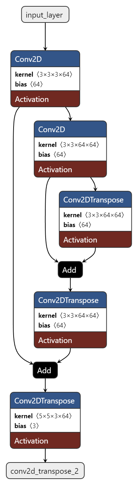

# AI Image Upscaler

## Description
A DSRCNN model with a Flask frontend for image upscaling.

## Installation

### Exe version

1. Download `flask_app.exe`.
2. Run `flask_app.exe`.
3. Copy and paste the generated URL into your browser.
4. Enjoy.

### Docker version

1. Make sure you have Docker installed on your system.
2. Download `flask_app.tar`.
3. Open a terminal in the directory of `flask_app.tar`.
4. Run the command: `docker load -i flask_app.tar`.
5. Open the docker desktop app run `flask_app`.
6. Make sure to set `Host Port` to `5000`.
7. Click the generated link or paste it into your browser.
8. Enjoy.

## Usage
To use the project, simply upload an image and click the "Enhance Image" button.

## License
This project is licensed under the MIT License - see the [LICENSE](LICENSE) file for details.

# Project Documentation

## Introduction
This section explains the process of creating the DSRCNN (Denoising Super-Resolution Convolutional Neural Network) and implementing it into a Flask application for upscaling images.

## Model Architecture
The DSRCNN model architecture was chosen for its powerful capabilities in image upscaling and complex understanding of feature mapping. The DSRCNN was tested against an SRCNN and CNN and showed significant improvements in qualitative image quality, PSNR (Peak signal-to-noise ratio), SSIM (Structural Similarity) Index, and MSE (Mean Squared Error) loss function.

The model is initialized with an input layer with an unspecified shape and the number of channels in the image. The model's layers consist of an input layer, 2 Conv2D layers, 2 Conv2DTranspose layers, 2 Add layers, and a final Conv2DTranspose output layer that upscales the image. 

The input layer is initialized without a specific shape to allow the model to process images of any size. The images are first encoded with Conv2D layers so the model can extract low-level features such as edges, curves, and textures and then decoded by Conv2DTranspose layers so the model can learn more advanced features. Add layers are included so that the model can learn residual connections between the Conv2D layers and the Conv2DTranspose layers, and the output of the final add layer is fed to a final Conv2DTranspose layer to produce the final, upscaled image.

## Training
The model was trained using the TensorFlow library and compiled with an Adam optimizer that had a learning rate of 0.001. It was trained on 1723 low-quality 128x128 resolution and high-quality 256x256 resolution image pairs, evaluated on 431 low-quality 128x128 resolution and high-quality 256x256 resolution image pairs, and achieved its best metrics at 50 epochs, its performance decreasing when trained any longer.

## Deployment
The DSRCNN model was integrated into a Flask application for deployment.The Flask application was kept simplistic and clean to preserve its functionality. The front end is a single web page built with HTML, CSS, and Javascript, which allows users to upload and enhance images. When a user uploads an image, the file is transferred to the Flask back end, where the model is loaded, the image is processed through the model, and an enhanced image is returned to the user.
